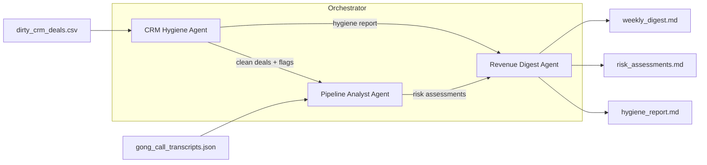

# revops-multi-agent-system

[](https://github.com/tyagiprabh/revops-multi-agent-system/actions/workflows/ci.yml)

A multi-agent pipeline for revenue operations. It takes two inputs every B2B sales team has,
a messy CRM export and raw sales-call transcripts, and turns them into three artifacts a
Head of Sales can act on: a hygiene report with an audit trail, a per-deal risk assessment
grounded in what the prospect actually said, and a weekly revenue digest.

The demo runs entirely offline with zero API keys. With an `ANTHROPIC_API_KEY`, the judgment
steps run on Claude instead of the rule engine.

## The problem

Two things quietly break most revenue forecasts:

1. **CRM data rots.** Lowercase names, five spellings of the same country, legacy picklist
   values, duplicate contacts, deals nobody touched in two months but that still sit in
   "Demo Scheduled".
2. **Reps have happy ears.** The CRM says "Technical Validation"; the transcript says
   *"We don't have the budget until Q3."* Stage and reality drift apart, and the forecast
   inherits the drift.

Cleaning this up by hand is a quarterly panic. This project treats it as a daily pipeline
of three specialized agents, each with a written spec, strict guardrails and a typed
output contract.

## Architecture



| Agent | Spec | What it does | Engine |
|---|---|---|---|
| CRM Hygiene | [`agents/crm_hygiene_agent.md`](agents/crm_hygiene_agent.md) | Auto-fixes deterministic formatting (name case, ISO country codes) with a full audit trail; flags duplicates, stale deals, free-mail contacts and picklist violations for human review | Rules engine, always |
| Pipeline Analyst | [`agents/pipeline_analyst_agent.md`](agents/pipeline_analyst_agent.md) | Cross-references each open deal's CRM stage against the latest call transcript (a BANT-style check: budget objections, competitor mentions, stalls, buying signals, radio silence) and scores High / Medium / Low risk with quoted evidence | Rules engine offline, Claude in live mode |
| Revenue Digest | [`agents/revenue_digest_agent.md`](agents/revenue_digest_agent.md) | Compresses everything into a weekly digest: pipeline by stage, ARR at risk, top 5 risky deals, hygiene status, 3 owner-assigned actions | Computed numbers always; Claude writes the executive summary in live mode |

The specs in [`agents/`](agents/) are platform-agnostic markdown. The same files work as
system prompts here, or drop into an agent platform like Dust with the CSV and JSON as
attached datasources.

## Quickstart

No API key needed:

```bash
git clone https://github.com/tyagiprabh/revops-multi-agent-system.git
cd revops-multi-agent-system
pip install -e .
python -m revops run
```

Output on the committed sample data (206 CRM records, 106 call transcripts):

```text
206 records -> 213 auto-fixes, 63 flags, 106 deals risk-assessed (39 High),
36 without call data.
Reports written to reports/latest/
```

A full pre-generated run is committed in [`reports/sample_run/`](reports/sample_run/),
so you can read the three artifacts without running anything. An excerpt from the digest:

> **$2,909,572** of ARR sits in **39** High risk deals (106 deals assessed, 36 without call data).
>
> | Deal | ARR | CRM stage | Why it is at risk |
> |---|---|---|---|
> | DL-65435 | $142,539 | Discovery | Prospect said: "Well, we are also looking at AcmeCorp right now." |
> | DL-23069 | $131,226 | Discovery | Prospect said: "We don't have the budget until Q3." |

## Live mode (Claude)

```bash
pip install -e ".[live]"
export ANTHROPIC_API_KEY=sk-ant-...
python -m revops run --live
```

In live mode the Pipeline Analyst sends each transcript to Claude with the agent spec as
the system prompt, and the response is validated against the same pydantic
`RiskAssessment` schema the rule engine uses. The digest's executive summary is written
by Claude from the already-computed numbers. Model: `claude-opus-5` via the
[structured outputs API](https://platform.claude.com/docs/en/build-with-claude/structured-outputs).

For the smallest possible live example, [`run_claude_agent.py`](run_claude_agent.py) runs a
single deal through the Pipeline Analyst and prints the structured assessment:

```bash
python run_claude_agent.py --list          # see assessable deals
python run_claude_agent.py --deal DL-23069
```

## Design decisions

**Deterministic core, LLM judgment layer.** The hygiene agent never calls a model. Its
spec forbids any change that requires judgment, and a rules engine enforces that contract
better than a prompt can. The LLM earns its place where the input is unstructured language
(reading a transcript, writing a summary), not where a dictionary lookup does the job.

**Guardrails are code, not vibes.** The specs demand: no silent deletions, no auto-merge
of duplicates, every fix logged with old value, new value and reason, every number in the
digest computed rather than generated. Each of those has a test.

**Typed contracts between agents.** Agents exchange pydantic models
([`src/revops/schemas.py`](src/revops/schemas.py)), so the digest can only report deals
the hygiene pass approved, and live mode output is validated against the exact schema the
offline engine produces.

**Offline by default.** Reviewers, tests and CI need zero credentials. The `--live` flag
is an upgrade, not a requirement, which also means the LLM layer can be swapped without
touching the pipeline.

## Repository layout

```text
agents/               agent specs (markdown, platform-agnostic)
data/                 synthetic data generators + committed samples
docs/                 data dictionary
src/revops/           package: schemas, agents, orchestrator, CLI
reports/              committed sample run output
tests/                pytest suite (runs offline)
run_claude_agent.py   standalone live demo for a single deal
```

## Data

All data is synthetic, generated with [Faker](https://faker.readthedocs.io/) under fixed
seeds so runs are reproducible. The generators intentionally inject the failure modes the
agents must handle: lowercase names, country variants, free-mail addresses, legacy
picklist values, near-duplicate contacts, stale deals, and calls with objections,
competitor mentions or buying signals. Regenerate with:

```bash
pip install -e ".[data]"
python data/generate_crm.py
python data/generate_transcripts.py
```

A fourth generator, [`data/generate_dust_telemetry.py`](data/generate_dust_telemetry.py),
produces the ops side of running an agent fleet: workspaces, seats, deployed agents and
30 days of per-invocation telemetry (status, model, credit burn). It backs the
usage-analytics work on the roadmap and is independent of the CRM demo:

```bash
python data/generate_dust_telemetry.py        # 20 workspaces, 3,000 events
python data/generate_dust_telemetry.py 50 16000
```

## Tests

```bash
pip install -e ".[dev]"
ruff check src tests data && pytest
```

CI runs lint, the test suite on Python 3.9 and 3.12, and a full demo run on every push.

## Roadmap

- Salesforce connector so the hygiene agent runs against a real CRM sandbox instead of CSV
- Slack delivery of the weekly digest (n8n webhook)
- A forecast agent that reconciles rep commit against the analyst's risk scores
- A usage-analytics agent over the agent-fleet telemetry dataset (adoption, error rates,
  credit burn per model)

## License

MIT
